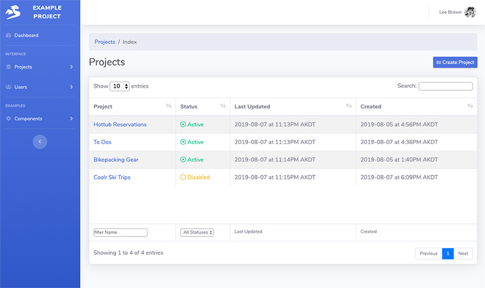
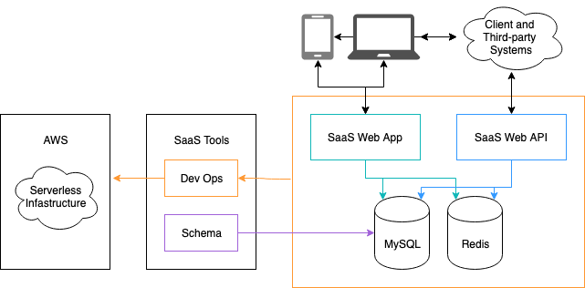
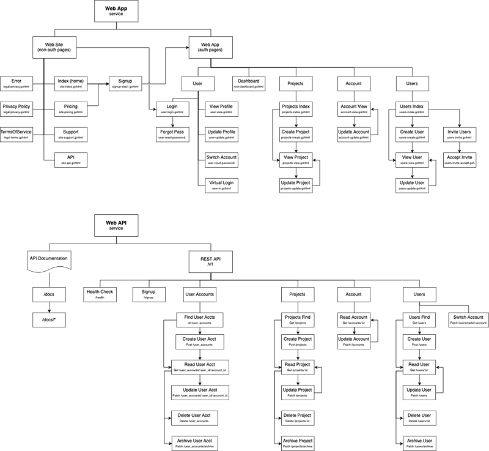

# SaaS Starter Kit

Copyright 2019, Geeks Accelerator 
twins@geeksaccelerator.com


## Description

The SaaS Starter Kit is a set of libraries for building scalable software-as-a-service (SaaS) applications while 
preventing both misuse and fraud. The goal of this project is to provide a proven starting point for new 
projects that reduces the repetitive tasks in getting a new project launched to production that can easily be scaled 
and ready to onboard enterprise clients. It uses minimal dependencies, implements idiomatic code and follows Golang 
best practices. Collectively, the toolkit lays out everything logically to minimize guess work and enable engineers to 
quickly load a mental model for the project. This inturn will make current developers happy and expedite on-boarding of 
new engineers. 

This project should not be considered a web framework. It is a starter toolkit that provides a set of working examples 
to handle some of the common challenges for developing SaaS using Golang. Coding is a discovery process and with that, 
it leaves you in control of your project’s architecture and development. 

SaaS product offerings typically provide two main components: an API and a web application. Both facilitate delivering a 
valuable software based product to clients ideally from a single code base on a recurring basis delivered over the 
internet. 

To see screen captures of the web app and auto-generated API documentation, check out this Google Slides deck:
https://docs.google.com/presentation/d/1WGYqMZ-YUOaNxlZBfU4srpN8i86MU0ppWWSBb3pkejM/edit#slide=id.p

*You are welcome to add comments to the Google Slides.*

[](https://docs.google.com/presentation/d/1WGYqMZ-YUOaNxlZBfU4srpN8i86MU0ppWWSBb3pkejM/edit#slide=id.p)


There are five areas of expertise that an engineer or her engineering team must do for a project to grow and scale. 
Based on our experience, a few core decisions were made for each of these areas that help you focus initially on writing 
the business logic.
1. Micro level - Since SaaS requires transactions, project implements Postgres. Implementation facilitates the data 
semantics that define the data being captured and their relationships. 
2. Macro level - The project architecture and design, provides basic project structure and foundation for development.
3. Business logic - Defines an example Golang package that helps illustrate where value generating activities should 
reside and how the code will be delivered to clients.
4. Deployment and Operations - Integrates with GitLab for CI/CD and AWS for serverless deployments with AWS Fargate.  
5. Observability - Implements Datadog to facilitate exposing metrics, logs and request tracing that ensure stable and 
responsive service for clients.  


The example project is a complete starter kit for building SasS with GoLang. It provides two example services:
* Web App - Responsive web application to provide service to clients. Includes user signup and user authentication for 
direct client interaction via their web connected devices. 
* Web API - REST API with JWT authentication that renders results as JSON. This allows clients and other third-pary companies to develop deep 
integrations with the project.

And these tools:
* Schema - Initializing of Postgres database and handles schema migration. 
* Dev Ops - Deploying project to AWS with GitLab CI/CD.

It contains the following features:
* Minimal web application using standard html/template package.
* Auto-documented REST API.
* Middleware integration.
* Database support using Postgres.
* Key value store using Redis
* CRUD based pattern.
* Role-based access control (RBAC).
* Account signup and user management.  
* Distributed logging and tracing.
* Integration with Datadog for enterprise-level observability. 
* Testing patterns.
* Use of Docker, Docker Compose, and Makefiles.
* Vendoring dependencies with Modules, requires Go 1.12 or higher.
* Continuous deployment pipeline. 
* Serverless deployments.
* CLI with boilerplate templates to reduce repetitive copy/pasting.
* Integration with GitLab for enterprise-level CI/CD.

Accordingly, the project architecture is illustrated with the following diagram. 



### Example project 

With SaaS, a client subscribes to an online service you provide them. The example project provides functionality for 
clients to subscribe and then once subscribed they can interact with your software service. 

The initial contributors to this project are building this saas-starter-kit based on their years of experience building 
building enterprise B2B SaaS. Particularily, this saas-starter-kit is based on their most recent experience building the
B2B SaaS for [standard operating procedure software](https://keeni.space) (100% Golang). Reference the Keeni.Space website,
its [SOP software pricing](https://keeni.space/pricing) and its signup process. The SaaS web app is then available at 
[app.keeni.space](https://app.keeni.space). They plan on leveraging this experience and build it into a simplified set 
example services for both a web API and a web app for SaaS businesses. 

For this example, *projects* 
will be the single business logic package that will be exposed to users for management based on their role. Additional 
business logic packages can be added to support your project. It’s important at the beginning to minimize the connection 
between business logic packages on the same horizontal level. 


This project provides the following functionality to users:

New clients can sign up which creates an account and a user with role of admin.
* Users with the role of admin can manage users for their account. 
* Authenticated users can manage their projects based on RBAC.

The project implements RBAC with two basic roles for users: admin and user. 
* The role of admin provides the ability to perform all CRUD actions on projects and users. 
* The role of user limits users to only view projects and users. 

Of course, this example implementation of RBAC can be modified and enhanced to meet your requirements. 

The project groups code in three distinct directories:
* Cmd - all application stuff (routes and http transport)
* Internal - all business logic (compiler protections) 
* Platform - all foundation stuff (kit)

All business logic should be contained as a package inside the internal directory. This enables both the web app and web 
API to use the same API (Golang packages) with the only main difference between them is their response, HTML or JSON.

The web API and web app have similar functionality. While the web app is meant for humans to experience and requires
a friendly UI, the web API is meant for customers or third-party partners of your SaaS to programmatically integrate. To 
help show the similarities and differences between the pages in the web app and similar endpoints in the web API, we 
have created this diagram below. Since it is very detailed, you can click on the image to see the larger version. 

[](https://gitlab.com/geeks-accelerator/oss/saas-starter-kit/tree/master/resources/images/saas-starter-kit-pages-and-endpoints-800x600.png)


## Local Installation

Docker is required to run this project on your local machine. This project uses multiple third-party services that will 
be hosted locally via Docker. 
* Postgres - Transactional database to handle persistence of all data.
* Redis - Key / value storage for sessions and other data. Used only as ephemeral storage.
* Datadog - Provides metrics, logging, and tracing.

An AWS account is required for deployment for the following AWS dependencies:
* Secret Manager - Provides store for private key used for JWT.
* S3 - Host static files on S3 with additional CDN support with CloudFront.
* ECS Fargate - Serverless deployments of application. 
* RDS - Cloud hosted version of Postgres. 
* Route 53 - Management of DNS entries. 


### Getting the project

Clone the repo into your desired location. This project uses Go modules and does not need to be in your GOPATH. You will 
need to be using Go >= 1.11.

You should now be able to clone the project. 

```bash
git clone git@gitlab.com:geeks-accelerator/oss/saas-starter-kit.git
cd saas-starter-kit/
```

If you have Go Modules enabled, you should be able compile the project locally. If you have Go Modulels disabled, see 
the next section.


### Go Modules

This project is using Go Module support for vendoring dependencies. 

We are using the `tidy` command to maintain the dependencies and make sure the project can create reproducible builds. 

```bash
GO111MODULE=on go mod tidy
```

It is recommended to use at least Go 1.12 and enable go modules.

```bash
echo "export  GO111MODULE=on" >> ~/.bash_profile
```


### Installing Docker

Docker is a critical component and required to run this project.

https://docs.docker.com/install/


## Running The Project

There is a `docker-compose` file that knows how to build and run all the services. Each service has its own a 
`dockerfile`.

When you run `docker-compose up` it will run all the services including the main.go file for each Go service. The 
services the project will run are:
- web-api
- web-app 
- postgres
- mysql


### Running the project

Use the `docker-compose.yaml` to run all of the services, including the 3rd party services. The first time to run this 
command, Docker will download the required images for the 3rd party services.

```bash
$ docker-compose up --build
```

Default configuration is set which should be valid for most systems. 

Use the `docker-compose.yaml` file to configure the services differently using environment variables when necessary. 

#### How we run the project

We like to run the project where the services run in the background of our CLI. This can be done by using the -d with 
the `docker-compose up` command: 
```bash
$ docker-compose up --build -d
```

Then when we want to see the logs, we can use the `docker-compose logs` command:
```bash
$ docker-compose logs
```

Or we can tail the logs using this command:
```bash
$ docker-compose logs -f
```


### Stopping the project

You can hit <ctrl>C in the terminal window running `docker-compose up`. 

Once that shutdown sequence is complete, it is important to run the `docker-compose down` command.

```bash
$ <ctrl>C
$ docker-compose down
```

Running `docker-compose down` will properly stop and terminate the Docker Compose session.

Note: None of the containers are setup by default with volumes and all data will be lost with `docker-compose down`. 
This is specifically important to remember regarding the postgres container. If you would like data to be persisted across 
builds locally, update `docker-compose.yaml` to define a volume. 


### Re-starting a specific Go service for development

When writing code in an iterative fashion, it is nice to be able to restart a specific service so it will run updated 
Go code. This decreases the overhead of stopping all services with `docker-compose down` and then re-starting all the 
services again with 'docker-compose up'.

To restart a specific service, first use `docker ps` to see the list of services running.

```bash
docker ps
CONTAINER ID        IMAGE                            COMMAND                  NAMES
35043164fd0d        example-project/web-api:latest   "/gosrv"                 saas-starter-kit_web-api_1
d34c8fc27f3b        example-project/web-app:latest   "/gosrv"                 saas-starter-kit_web-app_1
fd844456243e        postgres:11-alpine               "docker-entrypoint.s…"   saas-starter-kit_postgres_1
dda16bfbb8b5        redis:latest                     "redis-server --appe…"   saas-starter-kit_redis_1
```

Then use `docker-compose down` for a specific service. In the command include the name of the container for the service 
to shut down. In the example command, we will shut down down the web-api service so we can start it again.

```bash
docker-compose down saas-starter-kit_web-api_1
```

If you are not in the directory for the service you want to restart navigate to it. We will go to the directory for the 
web-api.

```bash
cd cmd/web-api/
```

Then you can start the service again by running main.go
```bash
go run main.go
```


### Optional. Set AWS and Datadog Configs

By default the project will compile and run without AWS configs or other third-party dependencies. 

As you use start utilizing AWS services in this project and/or ready for deployment, you will need to start specifying 
AWS configs in a docker-compose file. You can also set credentials for other dependencies in the new docker-compose file 
too.

The sample docker-compose file is not loaded since it is named sample, which allows the project to run without these 
configs.

To set AWS configs and credentials for other third-party dependencies, you need to create a copy of the sample 
docker-compose file without "sample" prepending the file name. 

Navigate to the root of the project. Copy `sample.env_docker_compose` to `.env_docker_compose`. 

```bash
$ cd $GOPATH/src/geeks-accelerator/oss/saas-starter-kit
$ cp sample.env_docker_compose .env_docker_compose
```

The example the docker-compose file specifies these environmental variables. The $ means that the variable is commented 
out.
```
$ AWS_ACCESS_KEY_ID=
$ AWS_SECRET_ACCESS_KEY=
AWS_REGION=us-east-1
$ AWS_USE_ROLE=false
$ DD_API_KEY=
```

In your new copy of the example docker-compose file ".env_docker_compose", set the AWS configs by updating the following 
environmental variables: AWS_ACCESS_KEY_ID, AWS_SECRET_ACCESS_KEY, and AWS_REGION. Remember to remove the $ before the 
variable name. 

As noted in the Local Installation section, the project is integrated with Datadog for observability. You can specify 
the API key for you Datadog account by setting the environmental variable: DD_API_KEY.


## Web API
[cmd/web-api](https://gitlab.com/geeks-accelerator/oss/saas-starter-kit/tree/master/cmd/web-api)

REST API available to clients for supporting deeper integrations. This API is also a foundation for third-party 
integrations. The API implements JWT authentication that renders results as JSON to clients. 

Once the web-app service is running it will be available on port 3001. 
http://127.0.0.1:3001/

This web-api service is not directly used by the web-app service to prevent locking the functionally required for 
internally development of the web-app service to the same functionality exposed to clients via this web-api service. 
This separate web-api service can be exposed to clients and be maintained in a more rigid/structured process to manage 
client expectations.

The web-app will have its own internal API, similar to this external web-api service, but not exposed for third-party 
integrations. It is believed that in the beginning, having to define an additional API for internal purposes is worth 
the additional effort as the internal API can handle more flexible updates. 

For more details on this service, read [web-api readme](https://gitlab.com/geeks-accelerator/oss/saas-starter-kit/blob/master/cmd/web-api/README.md)

### API Documentation

Documentation for this API service is automatically generated using [swag](https://github.com/geeks-accelerator/swag). Once this
web-api service is running, it can be accessed at /docs

http://127.0.0.1:3001/docs/


## Web App
[cmd/web-app](https://gitlab.com/geeks-accelerator/oss/saas-starter-kit/tree/master/cmd/web-app)

Responsive web application that renders HTML using the `html/template` package from the standard library to enable 
direct interaction with clients and their users. It allows clients to sign up new accounts and provides user 
authentication with HTTP sessions. The web app relies on the Golang business logic packages developed to provide an API 
for internal requests. 

Once the web-app service is running it will be available on port 3000. 
http://127.0.0.1:3000/

While the web-api service is rocking, this web-app service is still in development. Only the signup functionality works 
in order for a user to create the initial user with role of admin and a corresponding account for their organization. 
If you would like to help, please email twins@geeksinthewoods.com.

For more details on this service, read [web-app readme](https://gitlab.com/geeks-accelerator/oss/saas-starter-kit/blob/master/cmd/web-app/README.md)


## Schema 
[cmd/schema](https://gitlab.com/geeks-accelerator/oss/saas-starter-kit/tree/master/cmd/schema)

Schema is a minimalistic database migration helper that can manually be invoked via CLI. It provides schema versioning 
and migration rollback. 

To support POD architecture, the schema for the entire project is defined globally and is located inside internal: 
[internal/schema](https://gitlab.com/geeks-accelerator/oss/saas-starter-kit/tree/master/internal/schema)

Keeping a global schema helps ensure business logic can be decoupled across multiple packages. It is a firm belief that 
data models should not be part of feature functionality. Globally defined structs are dangerous as they create large 
code dependencies. Structs for the same database table can be defined by package to help mitigate large code 
dependencies. 

The example schema package provides two separate methods for handling schema migration:
* [Migrations](https://gitlab.com/geeks-accelerator/oss/saas-starter-kit/blob/master/internal/schema/migrations.go) -
List of direct SQL statements for each migration with defined version ID. A database table is created to persist 
executed migrations. Upon run of each schema migration run, the migraction logic checks the migration database table to 
check if it’s already been executed. Thus, schema migrations are only ever executed once. Migrations are defined as a function to enable complex migrations so results from query manipulated before being piped to the next query. 
* [Init Schema](https://gitlab.com/geeks-accelerator/oss/saas-starter-kit/blob/master/internal/schema/init_schema.go) - 
If you have a lot of migrations, it can be a pain to run all them. For example, when you are deploying a new instance of 
the app into a clean database. To prevent this, use the initSchema function that will run as-if no migration was run before (in a new clean database). 

Another bonus with the globally defined schema is that it enables the testing package to spin up database containers 
on-demand and automatically include all the migrations. This allows the testing package to programmatically execute 
schema migrations before running any unit tests. 


### Accessing Postgres 

To login to the local Postgres container, use the following command:
```bash
docker exec -it saas-starter-kit_postgres_1 /bin/bash
bash-5.0# psql -U postgres shared
```

The example project currently only includes a few tables. As more functionality is built into both the web-app and 
web-api services, the number of tables will expand. You can use the `show tables` command to list them. 
```commandline
shared=# \dt
             List of relations
 Schema |      Name      | Type  |  Owner   
--------+----------------+-------+----------
 public | accounts       | table | postgres
 public | migrations     | table | postgres
 public | projects       | table | postgres
 public | users          | table | postgres
 public | users_accounts | table | postgres
(5 rows)
```


## Deployment 

This project includes a complete build pipeline that relies on AWS and GitLab. The `.gitlab-ci.yaml` file includes the following build 
stages: 
```yaml
stages:
  - build:dev     # Build containers with configs targeting dev env.
  - migrate:dev   # Run database migration against the dev database.
  - deploy:dev    # Deploy the containers built for dev env to AWS ECS. 
  - build:stage   # Build containers with configs targeting stage env.
  - migrate:stage # Run database migration against the stage database.
  - deploy:stage  # Deploy the containers built for stage env to AWS ECS. 
  - build:prod    # Build containers with configs targeting prod env.
  - migrate:prod  # Run database migration against the prod database.
  - deploy:prod   # Deploy the containers built for prod env to AWS ECS. 
```

Currently `.gitlab-ci.yaml` only defines jobs for the first three stages. The remaining stages can be chained together 
so each job is dependant on the previous or run jobs for each target environment independently. 

A build tool called [devops](https://gitlab.com/geeks-accelerator/oss/saas-starter-kit/tree/master/tools/devops) has 
been included apart of this project. _Devops_ handles creating AWS resources and deploying your services with minimal 
additional configuration. You can customizing any of the configuration in the code. While AWS is already a core part of 
the saas-starter-kit, keeping the deployment in GoLang limits the scope of additional technologies required to get your 
project successfully up and running. If you understand Golang, then you will be a master at devops with this tool.

Refer to the [README](https://gitlab.com/geeks-accelerator/oss/saas-starter-kit/blob/master/tools/devops/README.md) for setup details. 

## Development Notes

### Datadog

Datadog has a custom init script to support setting multiple expvar urls for monitoring. The docker-compose file then 
can set a single env variable.
```bash
DD_EXPVAR=service_name=web-app env=dev url=http://web-app:4000/debug/vars|service_name=web-api env=dev url=http://web-api:4001/debug/vars
```

### Postgres and future MySQL support

Postgres is only supported based on its dependency of sqlxmigrate. MySQL should be easy to add to sqlxmigrate after 
determining a better method for abstracting the create table and other SQL statements from the main testing logic.

### SQLx bindvars

When making new packages that use sqlx, bind vars for mysql are `?` where as postgres is `$1`.

To database agnostic, sqlx supports using `?` for all queries and exposes the method `Rebind` to
remap the placeholders to the correct database.

```go
sqlQueryStr = db.Rebind(sqlQueryStr)
```

For additional details refer to [bindvars](https://jmoiron.github.io/sqlx/#bindvars)


## What's Next

We are in the process of writing more documentation about this code. We welcome you to make enhancements to this 
documentation or just send us your feedback and suggestions ; ) 


## Join us on Gopher Slack

If you are having problems installing, troubles getting the project running or would like to contribute, join the 
channel #saas-starter-kit on [Gopher Slack](http://invite.slack.golangbridge.org/) 
