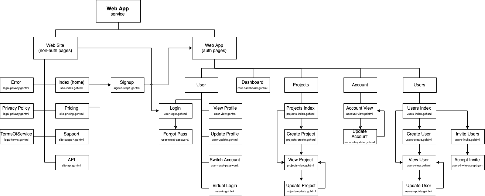

# SaaS Web App 

Copyright 2019, Geeks Accelerator  
twins@geeksaccelerator.com


## Description

Responsive web application that renders HTML using the `html/template` package from the standard library to enable 
direct interaction with clients and their users. It allows clients to sign up new accounts and provides user 
authentication with HTTP sessions. 

The web-app service is a fully functioning example. To see screen captures of the Golang web app, check out this Google 
Slides deck:
https://docs.google.com/presentation/d/1WGYqMZ-YUOaNxlZBfU4srpN8i86MU0ppWWSBb3pkejM/edit#slide=id.p

*You are welcome to add comments to the Google Slides.*

We have also deployed this example Go web app to production here:
https://example.saasstartupkit.com

[](https://example.saasstartupkit.com)

The web app relies on the Golang business logic packages developed to provide an API for internal requests. 

Once the web-app service is running it will be available on port 3000.

http://127.0.0.1:3000/


## Web App functionality 

This example web app allows customers to subscribe to the SaaS. Once subscribed they can authenticate with the web app 
and the business value can be delivered as a service. The business value of the example web app allows users to manage 
projects. Users with access to the project can perform CRUD operations on the record. 

This web-app service includes the following pages and corresponding functionality:

[](../../resources/images/saas-starter-kit-go-web-app-pages.png)


### landing pages

The example web-app service in the SaaS Startup Kit includes typical pages for new customers to learn about your 
service. It allows new customers to review a pricing page as well as signup. Existing customers of your SaaS can login 
or connect with your support resources. The static web page for your SaaS website also includes a page for your web API 
service. These are working example pages that a typical SaaS product usually include.

[](https://dzuyel7n94hma.cloudfront.net/img/saas-startup-example-golang-project-website-pricing.png)


### signup 

In order for your SaaS offering to deliver its value to your customer, they need to subscribe first. Users can subscribe 
using this signup page. 

[](https://dzuyel7n94hma.cloudfront.net/img/saas-startup-example-golang-project-website-signup.png)

The signup page creates an account and a user associated with the new account. This signup page 
also uses some cool inline validation.


### authentication

Software-as-a-Service usually provides its service after a user has created an account and authenticated. After a user 
has an account, they can login to your web app. Once logged in they will have access to all pages that require 
authentication. This login page also uses some cool inline validation.

[](https://dzuyel7n94hma.cloudfront.net/img/saas-startup-example-golang-project-website-login.png)

The GO web app implements Role-based access control (RBAC). The example web app has two basic roles for users: admin 
and user. 
* The role of admin provides the ability to perform all CRUD actions on projects and users. 
* The role of user limits users to only view projects and users.

Once a user is logged in, then RBAC is enforced and users only can access projects they have access to. 

The web-app service also includes functionality for logout and forgot password. The forgot password functionality 
send an email to the user with a link to web page that allows them to change their password. 


### projects

The example code for the web-app service exposes business value to authenticated users. This business value is coded into 
various business logic packages. One example business logic package is the one to create and manage Projects. In the 
SaaS Startup Kit, projects represent the highest level of business value. Users can perform CRUD on project records. 

The web app includes this index page that lists all records for projects. This index page uses Datatables to demonstrate 
providing advanced interactivity to HTML tables. This index page then allows users to view, update and delete an object.
 
[](https://dzuyel7n94hma.cloudfront.net/img/saas-startup-example-golang-project-webapp-projects.png)

From the projects index page, users can click the button to create a new record. This create page demonstrates how a new 
record can be created for projects and also demonstrates inline validation.

The view page for an object displays the fields for the object as read-only. The page then includes links to edit or 
archive the object. The archive functionality demonstrates how a soft-delete can be performed. While the web app does 
not expose functionality to delete a record, the internal API does support the delete operation.

[](https://dzuyel7n94hma.cloudfront.net/img/saas-startup-example-golang-project-webapp-project-view.png)

You can easily modify the projects package to support your own requirements. If you were providing a software-as-a-service 
similar to Github, Projects could be changed to be 'repositories'. If you were providing software-as-a-service similar 
to Slack, Projects could be modified to be 'channels', etc.


### user (profile)

After users authenticate with the web app, there is example code for them to view their user details (view their profile). 

[](https://dzuyel7n94hma.cloudfront.net/img/saas-startup-example-golang-project-webapp-profile-view2.png)
 
A user can then update the details for the record of their user. This another example demonstration the update operation. 
There is also functionality for the user to change their password.


### account (management)

When a user signups to your SaaS via the web app, an account is created. Authenticated users can then view the details 
of their account.

[](https://dzuyel7n94hma.cloudfront.net/img/saas-startup-example-golang-project-webapp-account-update2.png)
 
Users with role of admin can view and update the details of their account, while non-admins can only view the details 
of their account.

    
### users (management)

Users with role of admin have access to functionality that allows them to manage the users associated with their account. 
This index page uses Datatables to demonstrate providing advanced interactivity to HTML tables.

[](https://dzuyel7n94hma.cloudfront.net/img/saas-startup-example-golang-project-webapp-users.png)
 
From the users index page, users can access the functionality to create a new record. This create page demonstrates how 
a new record can be created for users. The create functionality also allows one or more roles to be applied for ACLs.

[](https://dzuyel7n94hma.cloudfront.net/img/saas-startup-example-golang-project-webapp-users-create.png)
 
If the admin would rather the new users provide their own user details, there is Go code demonstrating how users can be 
invited. The invite functionality allows users to specifiy one or more email addresses. Once submitted, the web app will 
send email invites to allow the users to activate their user.

From the users index page, admins for an account can view users details. This page also provides access to update the 
user as well as archive it.


## Local Installation

### Build 
```bash
go build .
``` 

### Docker 

To build using the docker file, need to be in the project root directory. `Dockerfile` references go.mod in root directory.

```bash
docker build -f cmd/web-app/Dockerfile -t saas-web-app .
```


## Getting Started 

### Errors 

- **validation error** - Test by appending `test-validation-error=1` to the request URL.
http://127.0.0.1:3000/signup?test-validation-error=1

- **web error** - Test by appending `test-web-error=1` to the request URL.
http://127.0.0.1:3000/signup?test-web-error=1


### Localization 

Test a specific language by appending the locale to the request URL.
127.0.0.1:3000/signup?local=fr


[github.com/go-playground/validator](https://github.com/go-playground/validator) supports the following languages.
- en - English 
- fr - French
- id - Indonesian
- ja - Japanese
- nl - Dutch
- zh - Chinese

### Future Functionality


